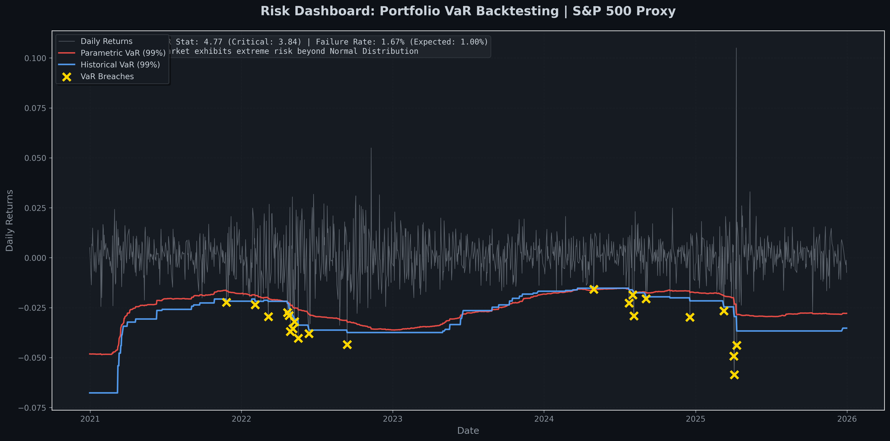

# Risk VaR Dashboard

A professional Value-at-Risk (VaR) calculation and backtesting dashboard for portfolio risk management.

## 📊 Dashboard Visualization



*Risk Dashboard showing daily returns, Parametric VaR (99%), Historical VaR (99%), and exception points where returns breach VaR thresholds.*

## Overview

This project implements a comprehensive VaR dashboard that:
- Calculates VaR using both **Parametric** (Normal Distribution) and **Historical Simulation** methods
- Performs **Kupiec POF (Proportion of Failures) Test** for model validation
- Visualizes risk metrics with real-time backtesting results

## Features

### 1. Data Ingestion
- Fetches real-time stock data using `yfinance`
- Calculates daily portfolio returns
- Supports multiple tickers (currently configured for SPY as S&P 500 proxy)

### 2. VaR Calculation Engine
- **Parametric VaR**: Assumes normal distribution, uses rolling mean and standard deviation
- **Historical VaR**: Uses empirical quantile from historical return distribution
- Rolling window: 252 trading days (1 year)

### 3. Backtesting Framework
- **Kupiec POF Test**: Statistical test to validate VaR model accuracy
- Tests null hypothesis: Model failure rate equals expected failure rate (1 - confidence level)
- Provides traffic-light system (PASS/FAIL) based on chi-square test

### 4. Visualization
- Interactive time series plot showing:
  - Daily portfolio returns (grey line)
  - Parametric VaR (99%) threshold (red dashed line)
  - Historical VaR (99%) threshold (blue line)
  - Exception points where returns breach VaR (black X markers)

## Installation

```bash
pip install -r requirements.txt
```

## Usage

```bash
python main.py
```

The script will:
1. Attempt to download historical data for SPY (2022-01-01 to 2026-01-01)
2. If API rate-limited, automatically fallback to synthetic data (geometric Brownian motion model)
3. Calculate rolling VaR metrics
4. Perform Kupiec backtest
5. Generate visualization and save to `images/var_dashboard.png`

**Note**: If yfinance API is rate-limited, the script will automatically use realistic synthetic data to demonstrate functionality. The synthetic data uses geometric Brownian motion with parameters similar to real market data (annual return ~10%, volatility ~20%).

## Development Notes

For detailed information about challenges encountered during development and their solutions, see [DEVELOPMENT_NOTES.md](DEVELOPMENT_NOTES.md). This document covers:
- API rate limiting and fallback mechanisms
- VaR calculation methodology and design decisions
- Kupiec test implementation details
- Data alignment and visualization challenges

## Technical Details

### VaR Methods

**Parametric VaR (99%):**
```
VaR = μ - Z(α) × σ
```
where:
- μ = rolling mean of returns
- σ = rolling standard deviation
- Z(α) = normal distribution quantile (α = 0.01 for 99% VaR)

**Historical VaR (99%):**
```
VaR = Quantile(returns, α)
```
Uses empirical distribution from rolling 252-day window.

### Kupiec Test

The Kupiec POF test evaluates whether the observed exception rate matches the expected rate:

- **Null Hypothesis (H₀)**: Model is accurate (exception rate = 1 - confidence level)
- **Test Statistic**: Likelihood Ratio (LR) follows chi-square distribution
- **Critical Value**: χ²(0.95, df=1) ≈ 3.84
- **Decision Rule**: If LR < critical value → PASS (model is accurate)

## Output

The dashboard generates:
1. Console output with Kupiec test statistics
2. Matplotlib visualization showing VaR thresholds and exceptions
3. Model validation status (PASS/FAIL)

## Impact

**Built a 99% VaR dashboard with Kupiec traffic-light backtesting for portfolio risk monitoring.**

This implementation demonstrates:
- Real-world financial data integration
- Statistical risk modeling (both parametric and non-parametric)
- Model validation using industry-standard backtesting framework
- Professional visualization for risk reporting

## Future Enhancements

- Monte Carlo VaR simulation
- Conditional VaR (CVaR) calculation
- Multi-asset portfolio support with correlation
- Real-time data streaming
- Web dashboard interface

## License

MIT License

